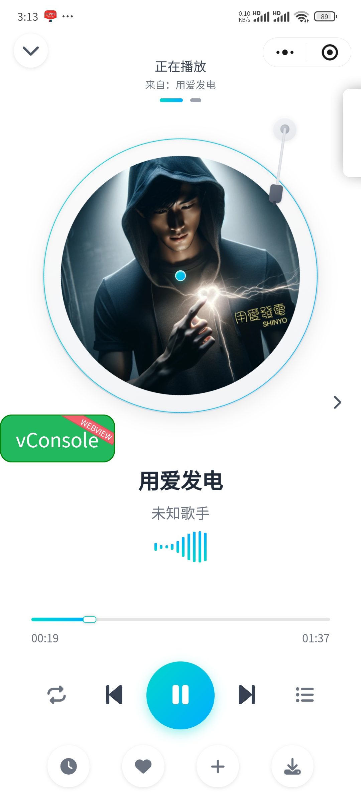

# 拼好歌 (PHG Music)

## ✨ 项目简介

"拼好歌"移动端 是一款基于微信小程序的面向技术爱好者的个人跨平台音乐播放器工具，支持鸿蒙系统、iPhone、Android设备直接使用。项目兼容洛雪音乐音源脚本生态（部分兼容）。项目是借鉴洛雪音乐源码编写出来的（抄来的）。应用提供完整的播放控制、歌单同步、定时关闭、后台播放完、暗黑模式等功能，界面简洁无广告。核心优势在于打破了iOS平台App必须上架应用市场的限制、鸿蒙系统无法安装Android App的限制。无需越狱、无需签名、无需TestFlight，微信扫码即可使用。项目代码开源且免费，如你是付费使用本项目，建议申请仅退款

## 🔗 关联项目

- **拼好歌后端服务器** - [dn-phg-music-server](https://github.com/erikjamesgz/dn-phg-music-server)

## 📸 应用截图

| 首页 | 歌单详情页 | 播放器 |
|:---:|:---:|:---:|
|  |  |  |

## 🚀 如何使用

> 本项目不打算上架微信小程序应用市场，需要用户自行下载微信开发者工具编译代码后用手机扫码使用。目前暂时只支持鸿蒙系统、iPhone、Android设备。Windows、macOS系统只能在微信开发者工具中的设备模拟器运行。

### 📋 使用步骤

#### 第一步：准备环境

1. **下载项目代码**
   - 准备一台电脑
   - 下载本项目代码到本地

2. **注册微信小程序开发者**
   - 注册成为微信小程序开发者
   - 获取 AppID（此AppID不能分享小程序他人使用，每个用户需要自己注册微信小程序开发者获取自己的AppID）
   - 教程：[微信小程序快速开始](https://developers.weixin.qq.com/miniprogram/dev/framework/quickstart/getstart.html)

3. **安装微信开发者工具**
   - 下载并安装微信开发者工具
   - 打开项目并设置 AppID

#### 第二步：配置项目

1. **配置开发者工具**
   - 在微信开发者工具中配置"不校验合法域名"
   - 教程：[配置教程](https://blog.csdn.net/weixin_66708577/article/details/156834305)

2. **生成预览二维码**
   - 点击微信开发者工具右上方的"预览"按钮
   - 生成二维码供手机扫描

#### 第三步：手机端配置

1. **开启开发者模式**
   - 手机扫描二维码打开小程序
   - 开启小程序开发者模式
   - 教程：[开启开发者模式](https://blog.csdn.net/m0_46613429/article/details/124845091)

2. **配置服务器地址**
   - 打开拼好歌小程序的设置页面
   - 点击"添加服务器地址"
   - 填入服务器地址：`https://xxxxx-dn-phg-musi-xx.deno.dev/你的API_KEY`
   - 点击"测试"，返回正常即配置成功
   
   > 如果没有自己的服务器，可以使用拼好歌的附属服务器项目：[dn-phg-music-server](https://github.com/erikjamesgz/dn-phg-music-server)

3. **导入音源脚本**
   - 在设置页面点击"音源管理"
   - 点击"在线导入"
   - 输入音源脚本地址
   - 点击"导入"
   - 选择默认调用音源

### ⚠️ 重要说明

#### 关于音源脚本

- ❌ **本项目不提供任何音源脚本**
- ❌ **不提供音源脚本的修改和定制服务**
- ✅ **支持洛雪音乐音源脚本生态（部分兼容）**
- ⚠️ **部分混淆过的脚本不支持，后续会持续优化**

#### 如何获取音源脚本

建议通过以下方式获取：
- 百度搜索"洛雪音乐音源脚本"
- 谷歌搜索"洛雪音乐音源脚本"
- GitHub 搜索"洛雪音乐音源脚本"
- 参考洛雪音乐音源脚本的编写规范自己编写

#### 常见问题

- **导入后无法播放**：该音源脚本在拼好歌项目中不支持，请更换其他音源脚本
- **播放异常**：部分混淆过的脚本不支持，建议使用未混淆的脚本

## 📱 功能模块

### 🏠 首页
- 轮播图推荐
- 猜你喜欢
- 排行榜广场
- 歌单广场
- 推荐歌单
- 新歌速递

### 🔍 搜索
- 多音源聚合搜索
- 搜索历史记录
- 热搜榜
- 搜索建议
- 支持歌曲、歌单、歌手、专辑搜索

### 🎵 播放器
- 全屏播放器界面
- 迷你播放器（底部悬浮）
- 播放控制（播放/暂停、上一首/下一首）
- 播放模式切换（列表循环、随机播放、顺序播放、单曲循环）
- 播放进度控制
- 歌词实时同步显示
- 收藏功能

### 📋 播放列表
- 试听列表
- 我的收藏
- 播放历史
- 自定义歌单管理
- 歌单导入导出

### 📊 排行榜
- 各平台热歌榜
- 新歌榜
- 飙升榜
- 多种分类排行

### 🎨 歌单广场
- 精选歌单推荐
- 分类歌单浏览
- 歌单详情预览

### ⚙️ 设置
- 音源管理
  - 在线导入音源
  - 音源编辑和删除
- 主题设置
  - 暗黑模式
  - 跟随系统主题
- 定时停止播放
- 设置服务器地址
- 音源管理
- 关于页面

## 📝 开源说明

### 开源协议

本项目基于 [Apache License 2.0](LICENSE) 许可证发行，以下协议是对于 Apache License 2.0 的补充，如有冲突，以以下协议为准。

#### 词语约定

本协议中的"本项目"指"拼好歌"项目；"使用者"指签署本协议的使用者；"官方音乐平台"指对本项目内置的包括酷我、酷狗、咪咕等音乐源的官方平台统称；"版权数据"指包括但不限于图像、音频、名字等在内的他人拥有所属版权的数据。

#### 一、数据来源

1.1 本项目的数据来源原理是从各官方音乐平台的公开服务器中拉取数据（与未登录状态在官方平台 APP 获取的数据相同），经过对数据简单地筛选与合并后进行展示，因此本项目不对数据的准确性负责。

1.2 本项目本身没有获取某个音频数据的能力，本项目使用的在线音频数据来源来自软件设置内"自定义源"设置所选择的"源"返回的在线链接。例如播放某首歌，本项目所做的只是将希望播放的歌曲名、艺术家等信息传递给"源"，若"源"返回了一个链接，则本项目将认为这就是该歌曲的音频数据而进行使用，至于这是不是正确的音频数据本项目无法校验其准确性，所以使用本项目的过程中可能会出现希望播放的音频与实际播放的音频不对应或者无法播放的问题。

1.3 本项目的非官方平台数据（例如"我的列表"内列表）来自使用者本地系统或者使用者连接的同步服务，本项目不对这些数据的合法性、准确性负责。

#### 二、版权数据

2.1 使用本项目的过程中可能会产生版权数据。对于这些版权数据，本项目不拥有它们的所有权。为了避免侵权，使用者务必在24小时内清除使用本项目的过程中所产生的版权数据。

#### 三、音乐平台别名

3.1 本项目内的官方音乐平台别名为本项目内对官方音乐平台的一个称呼，不包含恶意。如果官方音乐平台觉得不妥，可联系本项目更改或移除。

#### 四、资源使用

4.1 本项目内使用的部分包括但不限于字体、图片等资源来源于互联网。如果出现侵权可联系本项目移除。

#### 五、免责声明

5.1 由于使用本项目产生的包括由于本协议或由于使用或无法使用本项目而引起的任何性质的任何直接、间接、特殊、偶然或结果性损害（包括但不限于因商誉损失、停工、计算机故障或故障引起的损害赔偿，或任何及所有其他商业损害或损失）由使用者负责。

#### 六、使用限制

6.1 本项目完全免费，且开源发布于 GitHub 面向全世界人用作对技术的学习交流，本项目不对项目内的技术可能存在违反当地法律法规的行为作保证。

6.2 禁止在违反当地法律法规的情况下使用本项目，对于使用者在明知或不知当地法律法规不允许的情况下使用本项目所造成的任何违法违规行为由使用者承担，本项目不承担由此造成的任何直接、间接、特殊、偶然或结果性责任。

#### 七、版权保护

7.1 音乐平台不易，请尊重版权，支持正版。

#### 八、非商业性质

8.1 本项目仅用于对技术可行性的探索及研究，不接受任何商业（包括但不限于广告等）合作及捐赠。

#### 九、接受协议

9.1 若你使用了本项目，将代表你接受本协议。

## 📱 支持平台

| 平台 | 支持状态 | 备注 |
|------|---------|------|
| 微信小程序 | ✅ 完全支持 | 主要运行平台 |
| 鸿蒙系统 | ✅ 完全支持 | 通过微信小程序运行 |
| iOS | ✅ 完全支持 | 无需上架App Store |
| Android | ✅ 完全支持 | 通过微信小程序运行 |

## 🔧 技术实现

### 核心优势

- **打破平台限制** - 核心优势在于打破了iOS平台App必须上架应用市场的限制、鸿蒙系统无法安装Android App的限制
- **无需额外操作** - 无需越狱、无需签名、无需TestFlight，微信扫码即可使用
- **完全免费** - 项目代码开源且免费，如你是付费使用本项目，建议申请退款

### 音源兼容

- 兼容洛雪音乐音源脚本生态（部分兼容）
- 支持自定义音源脚本导入
- 用户可部署自己的音乐服务器

### 数据自主

- App数据完全由用户自己的服务器提供
- 不提供任何音乐内容，只提供播放能力
- 数据安全性由用户自己掌控

## 🤝 参与贡献

欢迎提交 Issue 和 Pull Request 参与项目开发。

### 贡献指南

1. Fork 本仓库
2. 新建分支 (`git checkout -b feature/AmazingFeature`)
3. 提交更改 (`git commit -m 'Add some AmazingFeature'`)
4. 推送到分支 (`git push origin feature/AmazingFeature`)
5. 提交 Pull Request

## 🙏 致谢

- [洛雪音乐](https://github.com/lyswhut/lx-music-mobile) - 项目参考来源
- [洛雪音乐](https://github.com/lyswhut/lx-music-desktop) - 桌面版参考
- 所有贡献者和使用者

## 📮 联系方式

如有问题或建议，欢迎通过以下方式联系：

- 提交 [Issue](https://gitee.com/asoul01/phg_music/issues)
- 查看项目文档

## ⚠️ 重要提示

1. **本项目不提供任何音乐内容**，只提供播放能力
2. **用户需自行部署音乐服务器**或使用合法的音乐源
3. **请尊重版权**，支持正版音乐
4. **本项目完全免费**，如你是付费使用，建议申请退款
5. **使用本项目即代表接受上述协议**

---

**⭐ 如果这个项目对你有帮助，请给一个 Star 支持一下 ⭐**

Made with ❤️ by PHG Music (Asoul)

