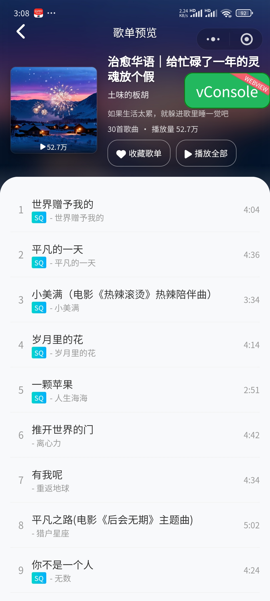
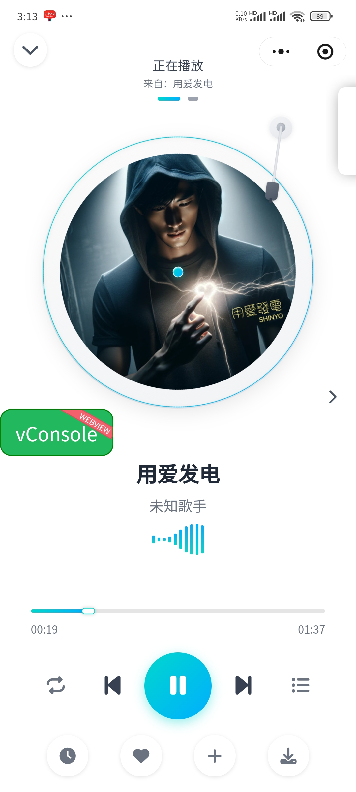

  

# 拼好歌 (PHG Music)

一款跨平台音乐播放器工具 · 支持鸿蒙/iPhone/Android/windows/mac/linux

## ✨ 项目简介

"拼好歌"移动端 是一款面向技术爱好者的个人跨平台音乐播放器工具，支持鸿蒙/iPhone/Android/windows/mac/linux设备使用。项目兼容洛雪音乐音源插件脚本生态（小部分不兼容）。项目是借鉴洛雪音乐源码编写出来的。应用提供完整的播放控制、歌单同步、定时关闭、后台播放完、暗黑模式等功能，界面简洁无广告。核心优势在于打破了iOS平台App必须上架应用市场的限制、鸿蒙系统无法安装Android App的限制。无需越狱、无需签名、无需TestFlight。项目代码开源且免费，如你是付费使用本项目，建议申请仅退款

## 🔗 关联项目（服务器二选一）

### 服务器环境一：Cloudflare 版本（推荐👍🏻）

**拼好歌后端服务器** - [cf\_phg\_music\_server](https://github.com/erikjamesgz/cf_phg_music_server)

- 每天免费调用量 **10万次**，支持多人同时使用

### 服务器环境二：Deno 版本

**拼好歌后端服务器** - [dn-phg-music-server](https://github.com/erikjamesgz/dn-phg-music-server)

- 免费版：每月 1万次调用量，适合 1 人使用，不推荐
- 免费版绑定银行卡后：每月 10万次调用量
- 无需配置自定义域名，默认域名可在中国大陆正常访问

## 📸 应用截图

|                                    首页                                   |                                    歌单详情页                                   |                                    播放器                                   |
| :---------------------------------------------------------------------: | :------------------------------------------------------------------------: | :----------------------------------------------------------------------: |
|  |  |  |

|                         桌面端/平板模式                        |
| :-----------------------------------------------------: |
|  |

## 🚀 如何使用

> iOS/华为纯血鸿蒙客户端只能在微信小程序使用，且微信小程序端不打算上架微信小程序应用市场，需要用户自行下载微信开发者工具编译代码后用手机扫码使用。Android/windows/mac/linux可以直接下载客户端使用。

使用的关键流程为：下载/搭建客户端 → **选择服务器模式** → 导入自己/第三方的音源插件脚本。

### 🎯 服务器模式选择（v1.0.10 新增）

首次打开 APP 会弹出手动选择服务器模式：

| 模式 | 适合人群 | 说明 |
| :--- | :--- | :--- |
| **专属服务器** | 已部署自己服务器的用户 | 使用自己的服务器，支持多端同步、AI 推荐等全功能 |
| **公共服务器** | 没有服务器的用户 | 由社区分享者提供公共服务器节点，导入本地音源插件即可播放 |

> 模式可在 设置 → 服务器地址 / 公共服务器节点 中随时切换。

### 📋 使用步骤

#### Android/windows/mac/linux设备

可以直接下载安装 APK，无需配置开发环境。

1. **下载安装拼好歌**
   - 访问 [GitHub Releases](https://github.com/erikjamesgz/phg-music/releases) 下载最新版本 APK
   - 安装到手机即可使用
2. **选择服务器模式**
   - 首次打开 APP 会自动弹出模式选择弹窗
   - **专属服务器模式**：填入服务器地址 `https://你的域名/你的API_KEY`，点击测试
   - **公共服务器模式**：无需配置服务器，直接导入本地音源插件即可使用
   > 如果没有自己的服务器，可以使用拼好歌的附属服务器项目：[关联项目（服务器二选一）](https://github.com/erikjamesgz/phg-music#-%E5%85%B3%E8%81%94%E9%A1%B9%E7%9B%AE%E6%9C%8D%E5%8A%A1%E5%99%A8%E4%BA%8C%E9%80%89%E4%B8%80)
3. **导入音源插件**
   - 在设置页面点击"音源插件管理"
   - 点击"在线导入"
   - 输入音源插件脚本地址
   - 点击"导入"
   - 选择默认调用音源插件
   > 建议导入 2-3 个音源插件，当某个插件不可用时将自动切换其他插件获取链接

#### iOS/华为纯血鸿蒙 设备

iOS 和纯血鸿蒙系统用户需要使用微信开发者工具编译项目。

##### 第一步：准备环境

1. **下载项目代码**
   - 准备一台电脑
   - 下载本项目代码到本地
2. **注册微信小程序开发者**
   - 注册成为微信小程序开发者
   - 获取 AppID（此 AppID 不能分享小程序给他人使用，每个用户需要自己注册微信小程序开发者获取自己的 AppID）
   - 教程：[微信小程序快速开始](https://developers.weixin.qq.com/miniprogram/dev/framework/quickstart/getstart.html)
3. **安装微信开发者工具**
   - 下载并安装微信开发者工具
   - 打开项目并设置 AppID

##### 第二步：配置项目

1. **配置开发者工具**
   - 在微信开发者工具中配置"不校验合法域名"
   - 教程：[配置教程](https://blog.csdn.net/weixin_66708577/article/details/156834305)
2. **生成预览二维码**
   - 点击微信开发者工具右上方的"预览"按钮
   - 生成二维码供手机扫描

##### 第三步：手机端配置

1. **开启开发者模式**
   - 手机扫描二维码打开小程序
   - 开启小程序开发者模式
   - 教程：[开启开发者模式](https://blog.csdn.net/m0_46613429/article/details/124845091)
2. **选择服务器模式**
   - 打开拼好歌小程序的设置页面
   - 首次使用会自动弹出模式选择弹窗，也可在设置中手动切换
   - **专属服务器模式**：点击"添加服务器地址"，填入 `https://你的域名/你的API_KEY`，点击测试
   - **公共服务器模式**：无需配置服务器，直接导入本地音源插件即可使用
   > 如果没有自己的服务器，可以使用拼好歌的附属服务器项目：[关联项目（服务器二选一）](https://github.com/erikjamesgz/phg-music#-%E5%85%B3%E8%94%94%E9%A1%B9%E7%9B%AE%E6%9C%8D%E5%8A%A1%E5%99%A8%E4%BA%8C%E9%80%89%E4%B8%80)
3. **导入音源插件**
   - 在设置页面点击"音源插件管理"
   - 点击"在线导入"
   - 输入音源插件脚本地址
   - 点击"导入"
   - 选择默认调用音源插件
   > 建议导入 2-3 个音源插件，当某个插件不可用时将自动切换其他插件获取链接

### ⚠️ 重要说明

#### 关于音源插件脚本

- ❌ **本项目不提供任何音源插件脚本**
- ❌ **不提供音源插件脚本的修改和定制服务**
- ✅ **支持洛雪音乐音源插件脚本生态（小部分不兼容）**
- ⚠️ **部分混淆过的脚本不支持，后续会持续优化**
- 💡 **公共服务器模式下，音源插件仅保存在本地，不会上传到服务器**
- 💡 **建议导入 2-3 个音源插件，播放时自动切换可用插件获取链接**

#### 关于服务器版本兼容性

- 客户端会自动检查服务端版本兼容性，版本过低时弹窗提醒升级
- 最低要求服务端版本：**v1.0.10**

#### 如何获取音源插件脚本

建议通过以下方式获取：

- 百度搜索"洛雪音乐音源插件脚本"
- 谷歌搜索"洛雪音乐音源插件脚本"
- GitHub 搜索"洛雪音乐音源插件脚本"
- 参考洛雪音乐音源插件脚本的编写规范自己编写

#### 常见问题

- **导入后无法播放**：该音源插件脚本在拼好歌项目中不支持，请更换其他音源插件脚本
- **播放异常**：部分混淆过的脚本不支持，建议使用未混淆的脚本

## 📱 功能模块

### 🏠 首页

- 轮播图推荐
- 猜你喜欢
- 排行榜广场
- 歌单广场
- 推荐歌单
- 新歌速递
- 首次使用弹窗选择服务器模式（专属/公共）
- 共享引导弹窗（闲置服务器分享提示）
- 引导免费用户部署服务器

### 🌐 Mesh 公共服务器网络（V1.0.10 新增）

- **双模式切换**：专属服务器模式 / 公共服务器模式
- **智能节点选择**：首选节点 → 活跃节点 → 跳过最近失败节点
- **自动降级**：自有服务器失败后自动切换到公共服务器节点
- **多脚本携带**：免费模式下自动携带本地音源插件到公共服务器

### 🤝 服务器分享（V1.0.10 新增）

- **一键分享**：将闲置服务器算力共享给社区
- **分享者名称**：自定义昵称，播放时展示在使用者播放器上
- **额度控制**：可设置每日共享额度（20,000 - 95,000），保留保底配额
- **贡献成就系统**：
  - 社区贡献徽章和称号系统（分享天数越多解锁更高称号）
- **仅分享算力**：不分享个人音源插件

### 🔍 搜索

- 多音源插件聚合搜索
- 搜索历史记录
- 热搜榜
- 搜索建议
- 支持歌曲、歌单、歌手、专辑搜索

### 🎵 播放器

- 全屏播放器界面
- 迷你播放器（底部悬浮）
- 播放控制（播放/暂停、上一首/下一首）
- 播放模式切换（列表循环、随机播放、顺序播放、单曲循环）
- 播放进度控制
- 歌词实时同步显示
- 收藏功能
- 音源提供者信息展示（播放 10 秒后显示音源脚本名称）
- 公共服务器分享者信息展示（播放 15 秒后显示分享者名称）
- iOS 后台卡死检测与自动恢复
- 缓存 URL 失效自动刷新（区分缓存 URL 与新 URL 播放失败）
- 不支持音频格式自动跳过（.mmp4 .wma 等）
- 换源信息完整性检查与自动恢复
- 服务器错误码处理（410 未导入脚本 / 411 不支持该源 / 412 换源失败）

### 📋 播放列表

- 试听列表
- 我的收藏
- 播放历史
- 自定义歌单管理
- 歌单导入导出

### 📊 排行榜

- 各平台热歌榜
- 新歌榜
- 飙升榜
- 多种分类排行

### 👤 我的

- 歌曲统计（我的歌曲、累计听歌、今日时长、最爱歌手）
- 贡献成就展示（已分享时显示）
- 我的歌单管理
- 播放历史
- 我的收藏

### 🎨 歌单广场

- 精选歌单推荐
- 分类歌单浏览
- 歌单详情预览

### 🤖 AI 推荐

- AI 智能推荐歌曲
- 个性化推荐引擎
- 免费服务器模式下引导部署自有服务器
- 支持第三方 AI 服务配置
- 歌曲封面图片缓存与代理

### ⚙️ 设置

- 服务器地址管理
  - 专属服务器模式切换
  - 服务器地址配置与测试
  - 部署教程链接
- 服务器分享
  - 分享状态管理（开启/关闭/被踢下线）
  - 分享者名称设置
  - 每日共享额度滑块调整
  - 贡献成就面板（称号、累计帮助、分享天数、7 天趋势图）
- 公共服务器节点
  - 可用节点列表展示（含延迟、额度、使用量）
  - 首选节点设置
  - 活跃节点标记
  - 节点故障转移测试模式
- 音源插件管理
  - 在线导入音源插件（URL）
  - Raw 内容导入音源插件
  - 音源插件编辑和删除
  - 默认音源插件设置
  - 免费模式下本地脚本管理
  - 多插件提示与自动切换
- 主题设置
  - 暗黑模式
  - 跟随系统主题
- 定时停止播放
- 版本兼容性检查
- 关于页面

## 📝 开源说明

### 开源协议

本项目基于 [Apache License 2.0](LICENSE) 许可证发行，以下协议是对于 Apache License 2.0 的补充，如有冲突，以以下协议为准。

#### 词语约定

本协议中的"本项目"指"拼好歌"客户端项目及其关联的开源代码仓库；"开发者"指本项目的代码贡献者和发布者；"使用者"指签署本协议并使用本项目的任何人；"分享者"指自愿将自行部署的服务器计算资源共享给其他使用者的部署者；"音源脚本"指由第三方编写、使用者自行导入的 JavaScript 插件脚本；"官方音乐平台"指各音乐源的官方平台统称；"版权数据"指包括但不限于图像、音频、名字等在内的他人拥有所属版权的数据。

#### 一、数据来源

1.1 **开发者角色声明**：本项目为开源软件，开发者仅以个人名义在 GitHub 等平台发布源代码。开发者**不运营任何在线服务**，不控制、不监督任何用户自行部署的服务器实例，不提供、不存储、不传输任何音乐内容或音源脚本。

1.2 **数据来源说明**：本项目展示的在线数据（如搜索结果、歌单信息等）全部来自使用者连接的服务器（包括使用者自行部署的专属服务器或社区分享者提供的公共服务器）返回的数据。本项目的客户端仅作为播放器和工具，将使用者请求的歌曲信息传递给服务器，并展示服务器返回的结果。

1.3 **音源脚本说明**：本项目**不提供任何音源脚本**，音源脚本由使用者自行搜索、评估、导入和使用。音源脚本的作者、来源、行为均与本项目开发者无关。本项目仅提供执行脚本的插件框架，不对脚本的行为负责。

1.4 **数据准确性**：由于本项目不对服务器返回的数据进行合法性校验，使用过程中可能会出现希望播放的音频与实际播放的音频不对应或无法播放的问题，本项目及开发者不对此负责。

#### 二、版权数据

2.1 使用本项目的过程中可能会产生版权数据。对于这些版权数据，本项目不拥有它们的所有权。为了避免侵权，使用者务必在24小时内清除使用本项目的过程中所产生的版权数据。

#### 三、资源使用

3.1 本项目内使用的部分包括但不限于字体、图片等资源来源于互联网。如果出现侵权可联系本项目移除。

#### 四、免责声明

4.1 **开发者免责**：开发者不对使用者或分享者使用本项目的方式、目的和后果承担任何责任。开发者不保证本项目符合任何特定国家或地区的法律法规，使用者有义务在使用前确认其所在地的法律要求。

4.2 **分享者免责**：分享者自愿分享其自行部署的服务器计算资源，此行为完全基于自愿且非商业性质。分享者仅提供算力（CPU、网络带宽等基础设施），**不提供、不存储、不缓存、不传输任何音乐内容**。分享者服务器执行的音源脚本由使用者自行提供，分享者不知道、无法预知也无法控制脚本的具体行为，不对脚本可能产生的任何后果负责。

4.3 **损害责任**：由于使用本项目（包括但不限于客户端、服务器、音源脚本）或无法使用本项目而引起的任何性质的任何直接、间接、特殊、偶然或结果性损害（包括但不限于因商誉损失、停工、计算机故障或故障引起的损害赔偿，或任何及所有其他商业损害或损失）均由使用者自行承担。

4.4 **数据责任**：本项目及开发者、分享者不对通过本项目获取的任何数据的合法性、准确性、完整性负责。使用者应自行判断数据来源的合法性和适用性。

4.5 **第三方内容**：本项目可能访问或展示第三方网站或服务的内容，开发者及分享者不对这些第三方内容的合法性、准确性或可用性负责。

#### 五、使用限制

5.1 **技术学习用途**：本项目完全免费且开源，面向全世界人用作技术学习和交流。开发者不对项目内的技术可能存在违反当地法律法规的行为作保证。

5.2 **遵守法律法规**：禁止在违反当地法律法规的情况下使用本项目（包括客户端、服务器代码、音源脚本等）。对于使用者在明知或不知当地法律法规不允许的情况下使用本项目所造成的任何违法违规行为，由使用者自行承担全部责任。

5.3 **分享者义务**：分享者在开启分享功能前，应充分了解并接受本协议的所有条款。分享者有义务在收到任何合法的版权投诉或侵权通知时，立即停止分享功能并关闭相关服务。开发者不对分享者的分享行为承担任何责任。

5.4 **禁止商业用途**：任何人、机构不得拿本项目进行任何商业化活动，包括但不限于广告、付费服务、商业合作、捐赠等。分享者分享算力给社区使用必须完全自愿且非商业性质，不得通过分享获取任何形式的利益。

5.5 **禁止批量传播**：禁止使用本项目进行批量下载、缓存、传播版权数据的行为。

#### 六、版权保护与避风港机制

6.1 **尊重版权**：音乐平台和内容创作者不易，请尊重版权，支持正版。鼓励使用者在经济条件允许的情况下购买正版音乐服务。

6.2 **24小时删除原则**：为避免侵权，使用本项目的过程中可能会产生的版权数据，使用者务必在 24 小时内清除使用本项目的过程中所产生的版权数据。此原则不作为合法使用的依据，仅作为最低限度的保护措施。

6.3 **避风港机制（Safe Harbor）**：如任何权利人认为通过本项目获取的内容侵犯了其版权，可以通过以下方式联系：
   - 开发者 GitHub Issues：[https://github.com/erikjamesgz/phg-music/issues](https://github.com/erikjamesgz/phg-music/issues)
   - 开发者收到侵权通知后，会立即在公开渠道发布公告，提醒所有使用者和分享者遵守相关法律法规。

6.4 **分享者应对机制**：分享者在收到任何合法的版权投诉或侵权通知时，应立即停止分享功能并关闭相关服务。分享者有义务配合权利人要求采取必要措施（如封禁相关使用者IP、停止分享等）。此行为不构成对侵权行为的承认，仅是为了规避风险和配合法律要求。

#### 七、非商业性质

7.1 本项目仅用于对技术可行性的探索及研究，不得拿本项目进行任何商业化活动，也不接受任何商业（包括但不限于广告等）合作及捐赠。

#### 八、接受协议与风险提示

8.1 **协议接受**：若你使用了本项目（客户端或关联的服务器代码），即代表你完全理解并接受本协议的所有条款。

8.2 **使用前必读**：使用本项目前，请务必完整阅读本协议。如果你不同意本协议的任何条款，请不要使用本项目。

8.3 **最终解释权**：本协议的最终解释权归本项目开发者所有。开发者保留在必要时修改本协议的权利，修改后的协议将在 GitHub 公开并立即生效。

8.4 **高风险提示**：
   - 本项目仅作为技术学习和研究工具，**不保证在任何国家或地区的法律框架下合法使用**。
   - 使用者使用本项目获取版权内容的行为可能构成侵权，由此产生的法律后果由使用者自行承担。
   - 分享者开启分享功能后，其服务器可能被用于获取版权内容，分享者可能面临法律风险。分享者应充分评估风险并自行决定是否开启分享功能。
   - 开发者不对任何使用者的行为、分享者的行为、或任何第三方的行为承担责任。

8.5 **独立责任声明**：开发者、分享者、使用者、音源脚本提供者均为独立的法律主体。任一主体的行为不应被视为其他主体的授权、同意或共同侵权。

## 🙏 致谢

- [洛雪音乐](https://github.com/lyswhut/lx-music-desktop) - 桌面版参考,抄了洛雪音乐部分代码，感谢洛雪大哥
- Trae、Kimi、GML、MiniMax、Deepseek感谢它们这几个AI工具写的屎山代码

## ⚠️ 重要提示

1. **本项目不提供任何音乐内容**，只提供播放能力
2. **用户需自行部署音乐服务器**或使用合法的音乐源
3. **请尊重版权**，支持正版音乐
4. **本项目完全免费**，如你是付费使用，建议申请退款
5. **使用本项目即代表接受上述协议**

***

**⭐ 如果这个项目对你有帮助，请给一个 Star 支持一下 ⭐**

Made with ❤️ by PHG Music (Asoul)

